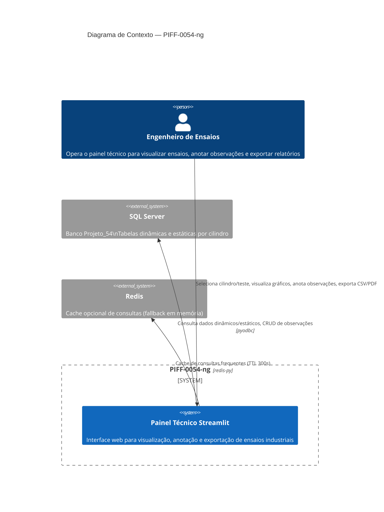
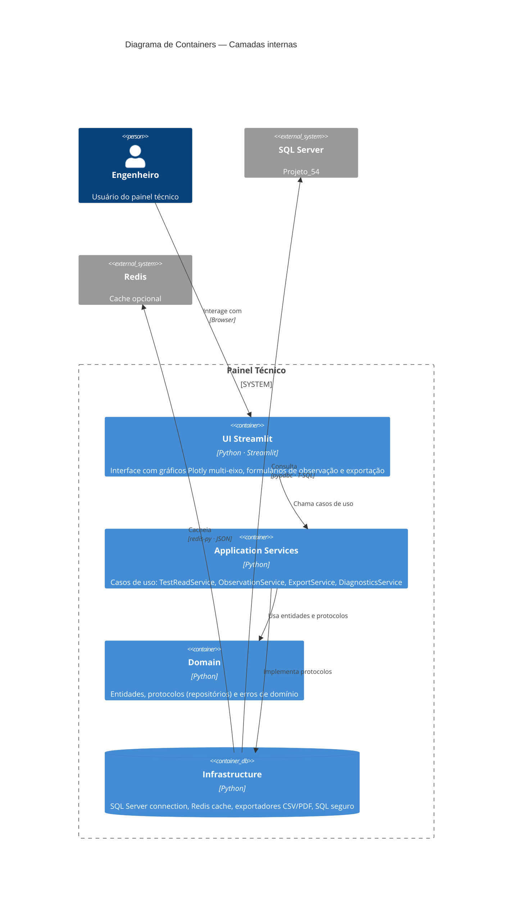
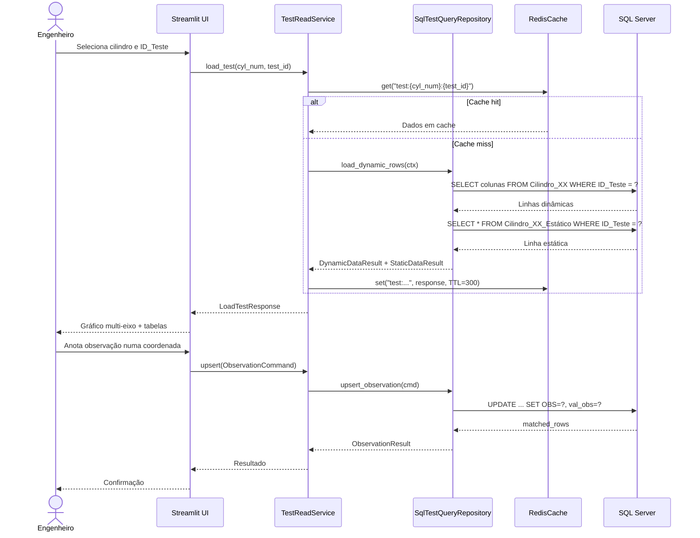
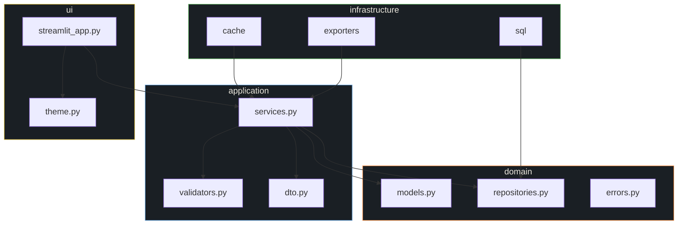
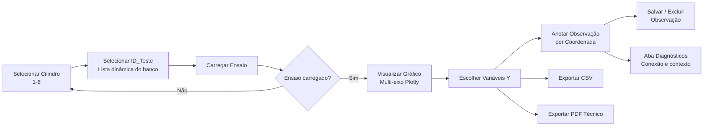

# PIFF-0054-ng

> **Sistema de visualização técnica de ensaios industriais** — persistência de observações por coordenada, exportação CSV/PDF e diagnósticos operacionais.

[](https://python.org)
[](https://streamlit.io)
[](https://microsoft.com/sql-server)
[](#)

---

## 1. Arquitetura

O sistema segue uma arquitetura em camadas (_clean architecture_ simplificada) com separação explícita entre domínio, aplicação, infraestrutura e interface.

### 1.1 Diagrama de Contexto (C4 Nível 1)



### 1.2 Diagrama de Containers (C4 Nível 2)



### 1.3 Diagrama de Sequência — Fluxo Principal



### 1.4 Diagrama de Componentes (C4 Nível 3) — `src/`



---

## 2. Pré-requisitos

| Recurso | Versão / Observação |
|---|---|
| **Python** | 3.11 ou superior |
| **SQL Server** | 2019+ com banco `Projeto_54` criado |
| **Driver ODBC** | `ODBC Driver 18 for SQL Server` (ou 17) — [instalação Linux](https://learn.microsoft.com/sql/connect/odbc/linux-mac/installing-the-microsoft-odbc-driver-for-sql-server) |
| **Redis** | Opcional — se indisponível, usa fallback em memória (`TTLCache`) |

---

## 3. Instalação

```bash
# 1. Clone o repositório
git clone <url-do-repositorio>
cd PIFF0054-ng

# 2. Crie e ative o ambiente virtual
python -m venv .venv
source .venv/bin/activate        # Linux/macOS
# .venv\Scripts\Activate.ps1     # Windows PowerShell

# 3. Instale as dependências
pip install -r requirements.txt
```

### Dependências ( `requirements.txt` )

| Pacote | Versão | Finalidade |
|---|---|---|
| `streamlit` | ≥ 1.37.0 | Interface web |
| `pandas` | ≥ 2.2.2 | Manipulação de dados |
| `plotly` | ≥ 5.23.0 | Gráficos multi-eixo interativos |
| `pyodbc` | ≥ 5.1.0 | Conexão SQL Server |
| `reportlab` | ≥ 4.2.2 | Geração de PDF técnico |
| `redis` | ≥ 5.0.0 | Cache Redis (fallback opcional) |
| `pytest` | ≥ 8.3.2 | Testes |
| `pytest-cov` | ≥ 5.0.0 | Cobertura de testes |

---

## 4. Configuração

O sistema é configurado exclusivamente por **variáveis de ambiente**. Crie um arquivo `.env` na raiz do projeto ou exporte as variáveis diretamente no shell.

### 4.1 Variáveis de Conexão SQL Server

| Variável | Padrão | Descrição |
|---|---|---|
| `PIFF_SQL_SERVER` | `localhost` | Host do SQL Server |
| `PIFF_SQL_DATABASE` | `Projeto_54` | Nome do banco de dados |
| `PIFF_SQL_USERNAME` | `sa` | Usuário (ignorado se `TRUSTED_CONNECTION=1`) |
| `PIFF_SQL_PASSWORD` | `P@ssw0rd_Projeto54!` | Senha (ignorado se `TRUSTED_CONNECTION=1`) |
| `PIFF_SQL_DRIVER` | `ODBC Driver 18 for SQL Server` | Nome do driver ODBC instalado |
| `PIFF_SQL_TRUSTED_CONNECTION` | `false` | `1` / `true` para autenticação Windows |

### 4.2 Variáveis de Cache

| Variável | Padrão | Descrição |
|---|---|---|
| `PIFF_CACHE_TTL_SECONDS` | `300` | Tempo de vida do cache (5 min) |
| `PIFF_REDIS_HOST` | `localhost` | Host Redis (fallback em memória se indisponível) |
| `PIFF_REDIS_PORT` | `6379` | Porta Redis |

### 4.3 Exemplo `.env`

```dotenv
PIFF_SQL_SERVER=192.168.1.100
PIFF_SQL_DATABASE=Projeto_54
PIFF_SQL_USERNAME=sa
PIFF_SQL_PASSWORD=MinhaSenhaAqui
PIFF_SQL_DRIVER=ODBC Driver 18 for SQL Server
PIFF_CACHE_TTL_SECONDS=300
```

> ⚠️ **Cilindros permitidos**: 1 a 6 (definido em `Settings.allowed_cylinders`).

---

## 5. Uso

### 5.1 Executar o Painel

```bash
streamlit run app.py
```

O painel será aberto em `http://localhost:8501`.

### 5.2 Fluxo de Operação



### 5.3 Funcionalidades da Interface

| Aba / Seção | Descrição |
|---|---|
| **Sidebar** | Seleção de cilindro (1–6) e ID_Teste com botão "Carregar ensaio" |
| **Gráfico multi-eixo** | Plotly interativo com eixos Y sobrepostos, cores da paleta industrial |
| **Observação por coordenada** | Seleciona `LocalCol` + variável Y → consulta observação existente → edita/salva/exclui |
| **Aba "Operação"** | Gráfico + formulário de observação |
| **Aba "Evidências"** | Exportação CSV (separador `;`) e PDF técnico (com gráfico, dados estáticos e amostra dinâmica) |
| **Aba "Diagnósticos"** | Estado da conexão SQL Server, drivers ODBC instalados, contexto ativo (JSON) |

---

## 6. Testes

```bash
# Executa todos os testes (unitários + integração)
pytest

# Com cobertura
pytest --cov=src --cov-report=term-missing

# Apenas testes unitários (sem banco)
pytest tests/unit/

# Apenas testes de integração (requer SQL Server acessível)
pytest tests/integration/
```

Os testes de UI utilizam Streamlit + Playwright para testes end-to-end com navegador headless.

---

## 7. Performance SQL

Scripts versionados em `sql/performance/` — recorte de otimização (01–06):

| Script | Descrição |
|---|---|
| `01_baseline_benchmark.sql` | Benchmark inicial das consultas |
| `02_create_composite_indexes.sql` | Cria índices compostos `(ID_Teste, LocalCol) INCLUDE (colunas úteis)` para eliminar _key lookups_ |
| `03_update_stats_and_index_review.sql` | Atualiza estatísticas e revisa a eficácia dos índices |

### Estratégia de índices

- Índice composto por cilindro: `IX_Cilindro_XX_ID_Teste_LocalCol`
- `INCLUDE` com colunas do conjunto `DYNAMIC_DEFAULT_COLUMNS` → _covering index scan_
- Redução de ~12s (full table scan) para milissegundos (index seek)

---

## 8. Estrutura do Projeto

```
PIFF0054-ng/
├── app.py                          # Entrypoint: streamlit run app.py
├── requirements.txt                # Dependências Python
├── pytest.ini                      # Configuração do pytest
├── .env.example                    # Template de configuração
│
├── src/
│   ├── __init__.py
│   │
│   ├── domain/                     # 🎯 Núcleo do domínio
│   │   ├── models.py               #   Entidades (dataclasses frozen)
│   │   ├── repositories.py         #   Protocolos (interfaces)
│   │   └── errors.py               #   Hierarquia de exceções
│   │
│   ├── application/               ️ # ⚙️ Casos de uso
│   │   ├── services.py             #   TestReadService, ObservationService, etc.
│   │   ├── validators.py           #   Validações de domínio
│   │   └── dto.py                  #   Data Transfer Objects
│   │
│   ├── infrastructure/            # 🔌 Adaptadores externos
│   │   ├── sql/
│   │   │   ├── connection.py       #   SqlServerConnection (ODBC)
│   │   │   ├── repositories.py     #   Implementações SQL dos protocolos
│   │   │   ├── safe_sql.py         #   Escape de identificadores (brackets)
│   │   │   └── schema.py           #   Nomes canônicos de tabelas/colunas
│   │   ├── cache.py                #   TTLCache em memória
│   │   ├── cache_redis.py          #   RedisCache com fallback
│   │   └── exporters/
│   │       ├── csv_exporter.py     #   SemicolonCsvExporter (separador ;)
│   │       └── pdf_exporter.py     #   TechnicalPdfExporter (ReportLab)
│   │
│   └── ui/                        # 🖥️ Interface com o usuário
│       ├── streamlit_app.py        #   Aplicação Streamlit principal
│       └── theme.py                #   Tema industrial "Steel & Amber"
│
├── tests/
│   ├── unit/                       # Testes unitários (sem banco)
│   │   ├── test_safe_sql.py
│   │   ├── test_services.py
│   │   └── test_validators.py
│   ├── integration/                # Testes de integração (requer SQL Server)
│   │   ├── test_db_queries.py
│   │   └── test_sql_repositories.py
│   └── ui/                         # Testes de interface (Streamlit + Playwright)
│       ├── test_streamlit_app.py
│       └── test_streamlit_e2e.py
│
├── sql/
│   ├── 03_create_projeto_54_ng.sql       # Schema do banco
│   ├── 04_create_projeto_54_hp.sql       # Schema high-performance (v1-v3)
│   ├── migrate_to_projeto_54_ng.py       # Migração de dados
│   ├── migrate_to_projeto_54_hp.py       # Migração HP
│   └── performance/                      # Scripts de otimização
│       ├── 01_baseline_benchmark.sql
│       ├── 02_create_composite_indexes.sql
│       └── 03_update_stats_and_index_review.sql
│
├── backups/                      # Backups do banco (.bak)
├── docs/                          # Documentação técnica adicional
│   ├── ENGENHARIA_REVERSA_SQL_PROJETO_54.md
│   ├── PERFORMANCE_REPORT_C01_TESTE_001.md
│   └── PERFORMANCE_REPORT_PROJETO54_HP_FINAL.md
├── spec/                          # Especificações de projeto
│   ├── spec-architecture-refatoracao-report-piff54-ng.md
│   ├── spec-process-backlog-operacional-checklist-refatoracao-piff54-ng.md
│   └── ...
└── imagens/                       # Recursos visuais
```

---

## 9. Licença

Proprietária — Projeto_54. Todos os direitos reservados.
