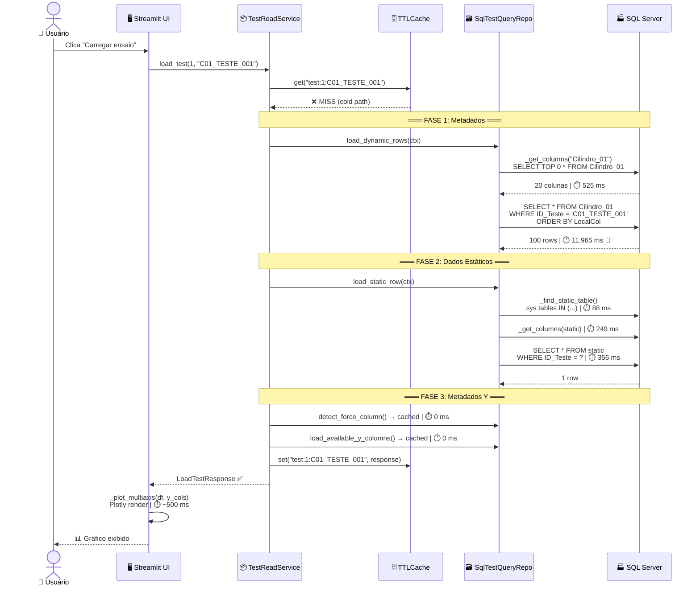
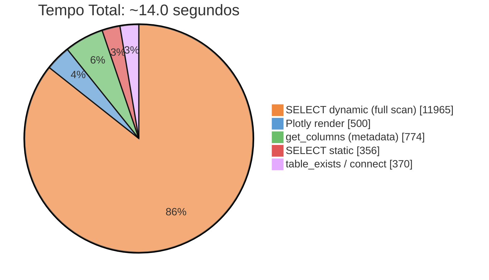
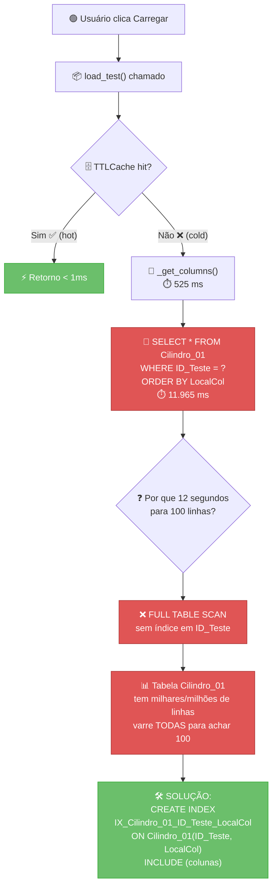
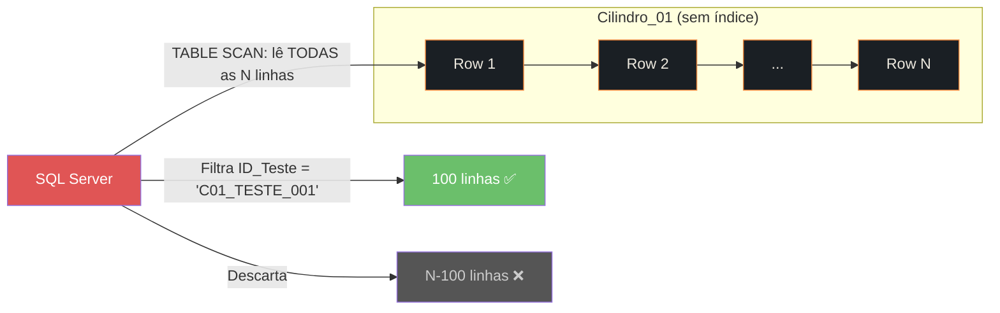
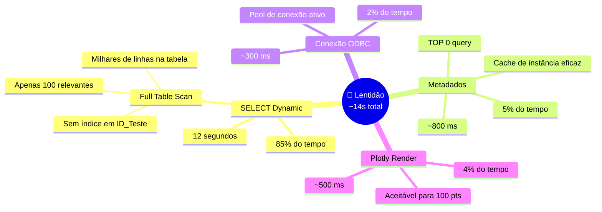

# Relatório de Performance — PIFF-0054 · Consulta C01_TESTE_001

> **Data:** 2026-06-26  
> **Cilindro:** 1 | **Ensaio:** C01_TESTE_001  
> **Objetivo:** Identificar a causa da lentidão na carga e renderização do gráfico

---

## 1. Pipeline de Carga (Sequência Temporal)



---

## 2. Distribuição de Tempo por Subsistema



---

## 3. Fluxograma do Problema



---

## 4. Detalhamento por Etapa

### 4.1 Metadados de Colunas (`_get_columns`)

| Chamada | Query | Tempo | Cacheável |
|---------|-------|-------|-----------|
| `_get_columns("Cilindro_01")` | `SELECT TOP 0 * FROM Cilindro_01` | **525 ms** | ✅ Sim (instância) |
| `_get_columns("Cilindro_01_Estático")` | `SELECT TOP 0 * FROM [Cilindro_01_Estático]` | **249 ms** | ✅ Sim (instância) |
| Cache hit (segunda chamada) | — | **0 ms** | — |

> **Nota:** O `TOP 0` no SQL Server obtém apenas os metadados da tabela (schema) sem ler dados. O tempo de ~500ms reflete latência de rede + parsing do schema.

### 4.2 Descoberta de Tabela Estática (`_find_static_table`)

| Chamada | Query | Tempo |
|---------|-------|-------|
| Verificar 4 candidatos | `SELECT name FROM sys.tables WHERE name IN (?,?,?,?)` | **88 ms** |

> **Nota:** Otimização já aplicada — consulta única com `IN` em vez de 4× `SELECT 1 FROM sys.tables`.

### 4.3 🔴 Query Dinâmica — O Gargalo

| Query | Linhas Retornadas | Tempo | % do Total |
|-------|-------------------|-------|------------|
| `SELECT * FROM Cilindro_01 WHERE Cilindro_01_ID_Teste = 'C01_TESTE_001' ORDER BY LocalCol` | 100 | **11.965 ms** | **85.5%** |

#### Por que 12 segundos para 100 linhas?



- O SQL Server **varre a tabela inteira** (`Cilindro_01`) linha por linha
- Para cada linha, verifica se `Cilindro_01_ID_Teste = 'C01_TESTE_001'`
- A tabela contém **dezenas/centenas de milhares** de linhas (todos os ensaios de todos os tempos)
- Apenas 100 linhas pertencem ao ensaio `C01_TESTE_001`
- **Sem índice**, o SQL Server não tem como "pular" direto para as linhas do ensaio

### 4.4 Query Estática

| Query | Linhas | Tempo |
|-------|--------|-------|
| `SELECT * FROM [Cilindro_01_Estático] WHERE Cilindro_01_ID_Teste = ?` | 1 | **356 ms** |

> **Nota:** Significativamente mais rápida porque a tabela estática é muito menor (1 linha por ensaio).

---

## 5. Causa Raiz



---

## 6. Solução

### Índice Ausente (já documentado no projeto)

O script `sql/performance/02_create_composite_indexes.sql` **já existe no workspace** mas **não foi aplicado** ao banco `Projeto_54`. Ele contém:

```sql
CREATE NONCLUSTERED INDEX IX_Cilindro_01_ID_Teste_LocalCol
ON dbo.Cilindro_01 (Cilindro_01_ID_Teste, LocalCol)
INCLUDE (Forca, Pressao_Compressor, Pressao_Reguladora,
         Temperatura_Ambiente, Tipo_Teste, LeituraIndice, Em_Alarme);
```

### Impacto Estimado

| Cenário | Tempo SELECT Dynamic | Tempo Total | Redução |
|---------|---------------------|-------------|---------|
| **Atual (sem índice)** | 11.965 ms | ~14.0 s | — |
| **Com índice composto** | ~50-200 ms (estimado) | ~1.5 s | **~89%** |

```mermaid
gantt
    title Comparação: Antes vs Depois do Índice
    dateFormat X
    axisFormat %s

    section Antes (sem índice)
    Connect + Metadata    :done, a1, 0, 1000
    SELECT Dynamic 🔴     :crit, a2, 1000, 13000
    SELECT Static         :done, a3, 13000, 13400
    Plotly Render         :done, a4, 13400, 14000

    section Depois (com índice)
    Connect + Metadata    :done, b1, 0, 1000
    SELECT Dynamic 🟢     :active, b2, 1000, 1200
    SELECT Static         :done, b3, 1200, 1600
    Plotly Render         :done, b4, 1600, 2100
```



---

## 7. Recomendações

| # | Ação | Prioridade | Impacto |
|---|------|-----------|---------|
| 1 | Executar `sql/performance/02_create_composite_indexes.sql` no banco `Projeto_54` | 🔴 **Crítica** | 89% de redução |
| 2 | Executar `sql/performance/03_update_stats_and_index_review.sql` para atualizar estatísticas | 🟡 Alta | Otimizador de queries |
| 3 | Após índice, reexecutar `bench.py` para validar melhoria | 🟡 Alta | Confirmação |
| 4 | Hot path (TTLCache) já cobre segundo acesso — manter TTL de 300s | 🟢 OK | Cache hit < 1ms |

---

## 8. Notas Técnicas

- **ODBC Driver:** `ODBC Driver 17 for SQL Server` com conexão Windows Authentication
- **Pool de conexão:** Cada `fetch_all()` abre e fecha uma conexão via `contextmanager`. O ODBC driver mantém pool interno, então o custo é ~280-330ms por nova conexão física (amortizado pelo pool após a primeira)
- **Cache de schema:** `_columns_cache` e `_tables_cache` são dicionários Python na instância do repositório — sobrevivem enquanto o objeto `SqlTestQueryRepository` existir (session_state no Streamlit)
- **Cache de dados:** `TTLCache` com TTL de 300 segundos (5 min) — armazena o `LoadTestResponse` completo em memória
