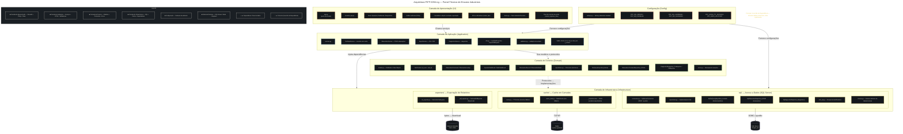

```mermaid
---
title: Arquitetura PIFF-0054-ng — Painel Técnico de Ensaios Industriais
---
graph TB
    %% ═══════════════════════════════════════════════════════════════
    %% ESTILOS
    %% ═══════════════════════════════════════════════════════════════
    classDef ui fill:#1a1f24,stroke:#f0883e,color:#ece8de,font-size:11px;
    classDef uiBox fill:#14181c,stroke:#f0883e,color:#ece8de,font-size:10px;
    classDef app fill:#1a1f24,stroke:#5b9bd5,color:#ece8de,font-size:11px;
    classDef appBox fill:#14181c,stroke:#5b9bd5,color:#ece8de,font-size:10px;
    classDef domain fill:#1a1f24,stroke:#6bbf6b,color:#ece8de,font-size:11px;
    classDef domainBox fill:#14181c,stroke:#6bbf6b,color:#ece8de,font-size:10px;
    classDef infra fill:#1a1f24,stroke:#e8c84a,color:#ece8de,font-size:11px;
    classDef infraBox fill:#14181c,stroke:#e8c84a,color:#ece8de,font-size:10px;
    classDef config fill:#1a1f24,stroke:#e05555,color:#ece8de,font-size:11px;
    classDef configBox fill:#14181c,stroke:#e05555,color:#ece8de,font-size:10px;
    classDef external fill:#14181c,stroke:#9b8ec4,color:#ece8de,font-size:11px;
    classDef legend fill:#1a1f24,stroke:#ece8de,color:#ece8de,font-size:10px;
    classDef note fill:none,stroke:none,color:#e8c84a,font-size:11px,font-style:italic;

    %% ═══════════════════════════════════════════════════════════════
    %% CAMADA DE APRESENTAÇÃO (UI)
    %% ═══════════════════════════════════════════════════════════════
    subgraph UI ["Camada de Apresentação (UI)"]
        direction TB
        UI_app["app.py<br/>(ponto de entrada)"]:::uiBox
        UI_streamlit["streamlit_app.py"]:::uiBox
        UI_tabs["Abas: Operação | Evidências | Diagnósticos"]:::uiBox
        UI_plotly["Gráfico multi-eixo (Plotly)"]:::uiBox
        UI_forms["Formulários: seleção, anotação, exportação"]:::uiBox
        UI_kpi["KPIs e indicadores (render_kpis)"]:::uiBox
        UI_theme["theme.py — Tema Industrial Precision"]:::uiBox
        UI_sig["Fluxo de controle de versão (render_signature_flow)"]:::uiBox
    end
    class UI ui;

    %% ═══════════════════════════════════════════════════════════════
    %% CAMADA DE APLICAÇÃO (APPLICATION)
    %% ═══════════════════════════════════════════════════════════════
    subgraph APP ["Camada de Aplicação (Application)"]
        direction TB
        APP_svcs["services.py"]:::appBox
        APP_ts["TestReadService — consulta com cache"]:::appBox
        APP_os["ObservationService — CRUD observações"]:::appBox
        APP_es["ExportService — CSV / PDF"]:::appBox
        APP_ds["DiagnosticsService — diagnóstico"]:::appBox
        APP_dto["dto.py — LoadTestResponse, ExportPdfRequest"]:::appBox
        APP_val["validators.py — validação de entrada"]:::appBox
        APP_vald["Valida: cilindro (1-6), test_id, obs_text, y_column"]:::appBox
    end
    class APP app;

    %% ═══════════════════════════════════════════════════════════════
    %% CAMADA DE DOMÍNIO (DOMAIN)
    %% ═══════════════════════════════════════════════════════════════
    subgraph DOM ["Camada de Domínio (Domain)"]
        direction TB
        DOM_models["models.py — Entidades e Value Objects"]:::domainBox
        DOM_tc["TestContext (cyl_num + test_id)"]:::domainBox
        DOM_oc["ObservationCommand / ObservationLookup"]:::domainBox
        DOM_dr["DynamicDataResult / StaticDataResult"]:::domainBox
        DOM_or["ObservationRecord / ObservationResult"]:::domainBox
        DOM_repos["repositories.py — Protocolos (interfaces)"]:::domainBox
        DOM_tqr["TestQueryRepository (leitura)"]:::domainBox
        DOM_ocr["ObservationCommandRepository (CRUD)"]:::domainBox
        DOM_outros["DiagnosticsRepository / CsvExporter / PdfExporter"]:::domainBox
        DOM_err["errors.py — Hierarquia de exceções"]:::domainBox
    end
    class DOM domain;

    %% ═══════════════════════════════════════════════════════════════
    %% CAMADA DE INFRAESTRUTURA (INFRASTRUCTURE)
    %% ═══════════════════════════════════════════════════════════════
    subgraph INFRA ["Camada de Infraestrutura (Infrastructure)"]
        direction TB

        subgraph INFRA_SQL ["sql/ — Acesso a Dados (SQL Server)"]
            direction TB
            SQL_conn["connection.py — SqlServerConnection (ODBC / pyodbc)"]:::infraBox
            SQL_repos["repositories.py — Implementações SQL"]:::infraBox
            SQL_tqr["SqlTestQueryRepository (consulta dinâmica/estática)"]:::infraBox
            SQL_obs["SqlObservationRepository (CRUD observações)"]:::infraBox
            SQL_diag["SqlDiagnosticsRepository (diagnóstico)"]:::infraBox
            SQL_safe["safe_sql.py — Escape de identificadores"]:::infraBox
            SQL_sch["schema.py — Nomes canônicos de tabelas/colunas"]:::infraBox
        end
        class INFRA_SQL infra;

        subgraph INFRA_CACHE ["cache/ — Cache em Camadas"]
            direction TB
            CACHE_mem["cache.py — TTLCache (memória, fallback)"]:::infraBox
            CACHE_redis["cache_redis.py — RedisCache (com fallback)"]:::infraBox
            CACHE_enc["_CacheEncoder — JSON pandas/numpy/datetime"]:::infraBox
        end
        class INFRA_CACHE infra;

        subgraph INFRA_EXP ["exporters/ — Exportação de Relatórios"]
            direction TB
            EXP_csv["csv_exporter.py — SemicolonCsvExporter"]:::infraBox
            EXP_pdf["pdf_exporter.py — TechnicalPdfExporter (ReportLab)"]:::infraBox
        end
        class INFRA_EXP infra;
    end
    class INFRA infra;

    %% ═══════════════════════════════════════════════════════════════
    %% CONFIGURAÇÃO (CONFIG)
    %% ═══════════════════════════════════════════════════════════════
    subgraph CFG ["Configuração (Config)"]
        direction TB
        CFG_set["settings.py — Settings (dataclass imutável)"]:::configBox
        CFG_v1["PIFF_SQL_SERVER / PIFF_SQL_DATABASE"]:::configBox
        CFG_v2["PIFF_SQL_USERNAME / PIFF_SQL_PASSWORD"]:::configBox
        CFG_v3["PIFF_CACHE_TTL_SECONDS / PIFF_REDIS_HOST:PORT"]:::configBox
    end
    class CFG config;

    %% ═══════════════════════════════════════════════════════════════
    %% SISTEMAS EXTERNOS
    %% ═══════════════════════════════════════════════════════════════
    EXT_SQL[("SQL Server<br/>Projeto_54")]:::external
    EXT_REDIS[("Redis<br/>(cache opcional)")]:::external
    EXT_OUT[("Arquivos Gerados<br/>CSV / PDF")]:::external

    %% ═══════════════════════════════════════════════════════════════
    %% CONEXÕES ENTRE CAMADAS
    %% ═══════════════════════════════════════════════════════════════
    UI -->|"Chama serviços"| APP
    APP -->|"Usa modelos e protocolos"| DOM
    APP -->|"Injeta dependências"| INFRA
    DOM -.->|"Protocolos → Implementações"| INFRA
    CFG -->|"Fornece configurações"| APP
    CFG -->|"Fornece configurações"| INFRA

    %% ═══════════════════════════════════════════════════════════════
    %% CONEXÕES — Infraestrutura → Sistemas Externos
    %% ═══════════════════════════════════════════════════════════════
    INFRA_SQL -->|"ODBC / pyodbc"| EXT_SQL
    INFRA_CACHE -->|"TCP/IP"| EXT_REDIS
    INFRA_EXP -->|"bytes → download"| EXT_OUT

    %% ═══════════════════════════════════════════════════════════════
    %% LEGENDA
    %% ═══════════════════════════════════════════════════════════════
    subgraph LEG ["Legenda"]
        direction TB
        L_ui["■ Camada de Apresentação — Streamlit + Plotly + Tema"]:::legend
        L_app["■ Camada de Aplicação — Serviços + DTOs + Validadores"]:::legend
        L_dom["■ Camada de Domínio — Modelos + Protocolos + Erros"]:::legend
        L_infra["■ Camada de Infraestrutura — SQL + Cache + Exportadores"]:::legend
        L_cfg["■ Configuração — Variáveis de ambiente"]:::legend
        L_ext["■ Sistemas Externos — SQL Server / Redis / Arquivos"]:::legend
        L_flow["──► Dependência / Fluxo de dados"]:::legend
        L_proto["- - ► Protocolo (Inversão de Dependência)"]:::legend
    end
    class LEG legend;

    %% ═══════════════════════════════════════════════════════════════
    %% NOTA — PRINCÍPIO
    %% ═══════════════════════════════════════════════════════════════
    NOTE["Princípio: Inversão de Dependência — Domínio define protocolos, Infra implementa"]:::note
```
